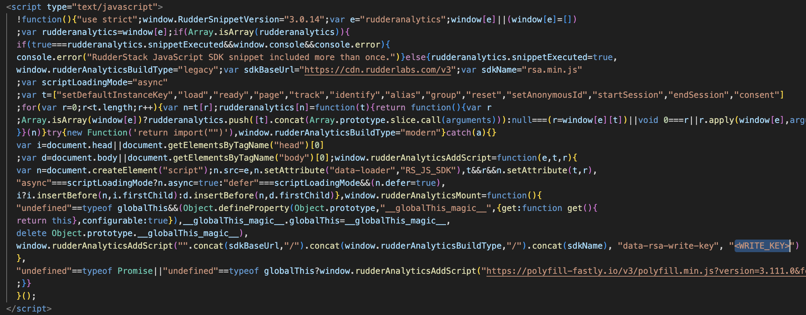

# RudderStack Flutter SDK Example App

This example app demonstrates how to use the RudderStack Flutter SDK with various integrations.

## Setup

### Prerequisites

1. **Navigate to Example Directory**
   ```bash
   cd example
   ```

2. **Create Environment File**
   ```bash
   cp sample.env .env
   ```
   Replace the values of `DUPLICATE_WRITE_KEY` and `DUPLICATE_DATA_PLANE_URL` in the `.env` file with actual values from your RudderStack Dashboard.

3. **Web Configuration (for Flutter Web)**
   Replace `<WRITE_KEY>` in `web/index.html` with your actual write key value.
   

### Install Dependencies

```bash
flutter pub get
```

### Local Development

For local development with the SDK source code, uncomment the `dependency_overrides` section in `pubspec.yaml`:

```yaml
dependency_overrides:
  rudder_sdk_flutter:
    path: "../packages/plugins/rudder_plugin"
  rudder_plugin_db_encryption:
    path: "../packages/plugins/rudder_plugin_db_encryption"
  rudder_integration_amplitude_flutter:
    path: "../packages/integrations/rudder_integration_amplitude_flutter"
  rudder_integration_adjust_flutter:
    path: "../packages/integrations/rudder_integration_adjust_flutter"
  rudder_integration_firebase_flutter:
    path: "../packages/integrations/rudder_integration_firebase_flutter"
  rudder_integration_braze_flutter:
    path: "../packages/integrations/rudder_integration_braze_flutter"
  rudder_integration_appcenter_flutter:
    path: "../packages/integrations/rudder_integration_appcenter_flutter"
  rudder_integration_leanplum_flutter:
    path: "../packages/integrations/rudder_integration_leanplum_flutter"
  rudder_integration_appsflyer_flutter:
    path: "../packages/integrations/rudder_integration_appsflyer_flutter"
```

Then run `flutter pub get` again to use the local packages.

## Build for Production

### Android APK

```bash
flutter build apk
```

### iOS

```bash
flutter build ios
```

### Web

**With WASM (recommended for better performance):**
```bash
flutter build web --wasm
```

**Without WASM:**
```bash
flutter build web
```

## Run for Development

### Open Simulators/Emulators

**Android Emulator:**
Open Android Studio and launch an emulator from the AVD Manager, or use command line:
```bash
flutter emulators --launch Pixel_7_API_34
```
To list available emulators: `flutter emulators`

**iOS Simulator:**
Open Xcode and launch a simulator from the Devices and Simulators window, or use command line:
```bash
open -a Simulator
```
To list available simulators: `xcrun simctl list devices`

### Run on Android

```bash
flutter run -d emulator-5554
```

### Run on iOS

```bash
flutter run -d iPhone
```

### Run on Web

**With WASM (recommended for better performance):**
```bash
flutter run -d chrome --wasm
```

**Without WASM:**
```bash
flutter run -d chrome
```

## Available Integrations

This example includes the following RudderStack integrations:

- Amplitude
- Adjust
- Firebase
- Braze
- AppCenter
- Leanplum
- AppsFlyer

## Available Plugins

- Database Encryption Plugin

## Troubleshooting

1. **Environment Variables Not Loading**: Ensure the `.env` file is in the example directory and the assets section in `pubspec.yaml` includes `- .env`.

2. **Build Issues**: Run `flutter clean` followed by `flutter pub get` to resolve dependency conflicts.

3. **Platform-specific Issues**: Ensure you have the required platform setup (Android Studio for Android, Xcode for iOS, etc.).